<h1 align="center">👋 Hi, I'm Abdulaziz Mohammedsani</h1>
<h3 align="center">🚀 Software Engineering Student | Backend Developer | A2SVian</h3>

  <a href="https://www.linkedin.com/in/abdulaziz-mohs/">LinkedIn</a>
  •
  <a href="mailto:accoabdulazizmohammed@gmail.com">Email</a>

🎓 Software Engineering Student at **Addis Ababa Science and Technology University (AASTU)**  
🎓 Backend Development Graduate from **ALX**  
🧠 **A2SVian** — Active student at **A2SV (Africa to Silicon Valley)**  
🏆 Presidential Award Recipient for Academic Excellence

I am passionate about building scalable backend systems, designing clean architectures, and solving complex algorithmic problems. At **A2SV**, I continuously strengthen my Data Structures and Algorithms skills while sharpening my problem-solving mindset.

My long-term goal is to build impactful systems that improve transparency and efficiency in real-world institutions.

---

## 🛠️ Tech Stack

| Area | Technologies |
| --- | --- |
| **Languages** | `Python` `JavaScript` `PHP` `C++` `Java` |
| **Frameworks** | `Django` `Next.js` `NestJS` |
| **Databases** | `MySQL` `PostgreSQL` |
| **Tools & DevOps** | `Git` `GitHub` `Bash` `Docker` |

---

## 📊 GitHub Stats

  
  

---

## 📌 Featured Project — GovGuide

**[GovGuide](https://github.com/abdulaziz-moh/GovGuide)** makes government services and processes easier to understand through searchable, step-by-step guides, clear requirements, and community feedback.

**Built with:** `Django` `Python` `MySQL` `HTML` `CSS` `JavaScript`

---

## 🎯 Current Focus

- 🧠 Advanced Data Structures & Algorithms through A2SV
- 🏗️ Scalable backend architecture
- 🔐 Secure and transparent system design
- ⚡ Performance optimization
- 🐳 Containerized development and deployment with Docker

---

## 🌍 Connect With Me

- **LinkedIn:** [Abdulaziz Mohammed](https://www.linkedin.com/in/abdulaziz-mohs/)
- **Email:** [accoabdulazizmohammed@gmail.com](mailto:accoabdulazizmohammed@gmail.com)

---

> I focus on consistent progress.
